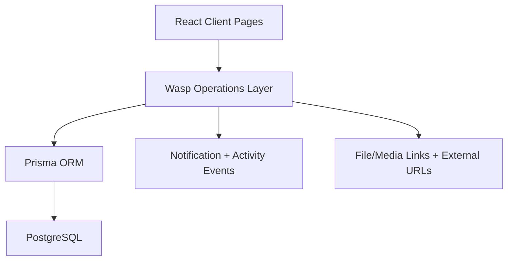

# System Design: BrandKlip (Current Implementation)

Last updated: 2026-03-03

## 1. Overview

BrandKlip is implemented as a Wasp-based web application where brand, creator, and admin workflows are enforced through server-side operations and Prisma-backed state transitions.

---

## 2. High-Level Architecture

Key point: business rules live in operation handlers (not in client UI), and the UI reads normalized state from queries.

---

## 3. Core Domains

### 3.1 Campaigns (Drops)
- Brand creates drops with product metadata and creator targeting.
- Creator discovery and apply flows use eligibility and status checks.

### 3.2 Applications
- Stateful lifecycle from profile submission through order proof and video delivery.
- Admin/brand actions change status via guarded server operations.

### 3.3 Review & Governance
- Order proof rejection/confirmation flow with reason capture.
- Video reshoot flow with structured rejection categories.
- Deadline-aware messaging and retry windows surfaced to creators.

---

## 4. Application State Model (Operational)

Common statuses in active use:

- `profile_submitted`
- `brand_approved` / `brand_rejected` / `waitlisted`
- `order_submitted` / `order_verify_required` / `order_disputed` / `order_verified`
- `video_submitted` / `reshoot_requested`
- `completed` / `expired`

State changes are validated in backend operations to prevent invalid transitions and silent no-op actions.

---

## 5. Policy Enforcement (Implemented)

### 5.1 Order Proof Policy
- Max retry attempts and explicit rejection feedback.
- Third failed path escalates to final failure handling.
- UI shows countdowns and clear “submit proof again” CTA when disputed.

### 5.2 Video Reshoot Policy
- Up to 3 video attempts.
- `adminRequestReshoot` requires structured reason + minimum detailed feedback.
- Final rejection marks application failed (`expired`) and applies cooldown semantics.
- Creator-facing final-attempt warnings + resubmit deadline countdowns.

---

## 6. Data Model Notes (Current)

The `Application` model includes video governance metadata such as:

- `videoRejectionReason`
- `videoLastRejectedAt`
- `videoResubmitDeadline`
- `videoFailedAt`

These fields support attempt tracking, deadline enforcement, queue context, and analytics.

---

## 7. Backend Components

### 7.1 Query/Action Layer
- Primary implementation file: `brandklip/app/src/application/ops.ts`.
- Responsibilities:
  - Role and status guards
  - Validation (including minimum feedback length checks)
  - Transition updates + timestamps/deadlines
  - Notification and admin activity side effects

### 7.2 Persistence
- Prisma schema and migrations under `brandklip/app`.
- Incremental migration strategy used for policy fields.

---

## 8. Frontend Architecture Notes

- Dashboard and detail pages are state-driven from server queries.
- Shared card/components handle status pills and deadline messaging.
- Dialog/sheet primitives include controlled body scroll locking to prevent mobile bleed/freeze regressions.
- Image previews in dashboard/drop surfaces use fit behavior (`object-contain`) for predictable rendering.

---

## 9. Reliability & Guardrails

- Prevent action execution when required prerequisites are incomplete (e.g., proof verification guards).
- Enforce minimum rejection reason quality to reduce ambiguous creator feedback.
- Surface backend failures via toasts/errors instead of silent UI states.

---

## 10. Near-Term Design Priorities

1. Add transition-level integration tests for policy-heavy operations.
2. Add operation audit reporting for approve/reject actions.
3. Expand queue analytics (attempt counts, rejection reasons, time-to-approval).
4. Consolidate policy constants and reason enums into a shared policy module.
